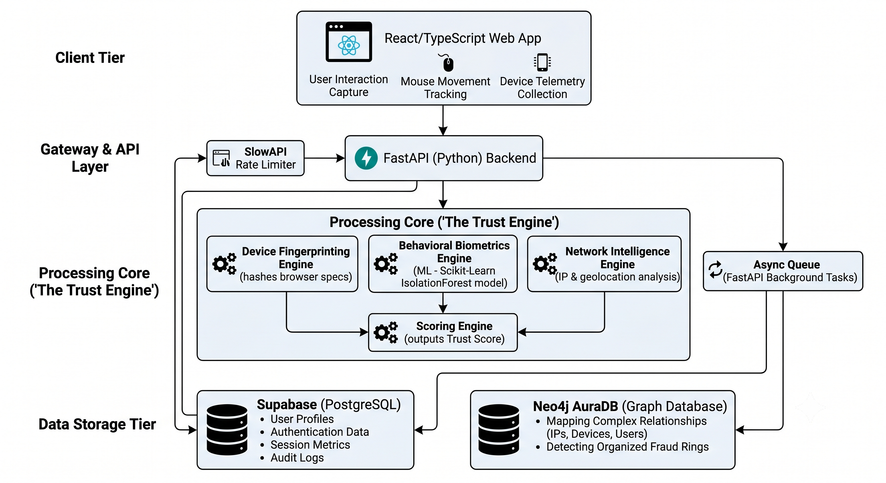
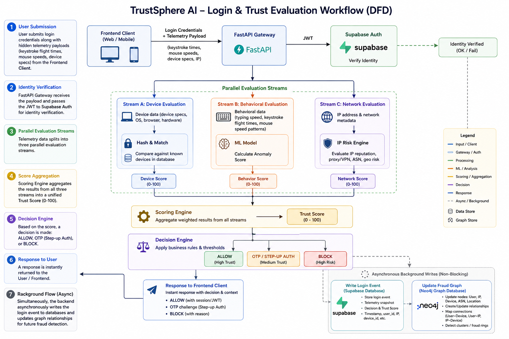

<div align="center">
  
# TrustSphere AI
### Real-Time Identity Trust & Adaptive Authentication Platform

<br />

**Live Application:** [https://trustsphere-web.onrender.com/](https://trustsphere-web.onrender.com/)

<br />

[](https://fastapi.tiangolo.com/)
[](https://reactjs.org/)
[](https://supabase.io/)
[](https://neo4j.com/)

<br />

*Built for the Bank of Baroda Hackathon 2026*

</div>

---

## Overview

**TrustSphere AI** is an advanced, real-time fraud detection and identity trust evaluation platform. Instead of relying solely on passwords, TrustSphere analyzes device fingerprints, behavioral biometrics (typing speed, mouse movements), and network signals continuously in the background to calculate a unified **Trust Score**.

Based on this score, the system dynamically:
- **Allows** low-risk logins seamlessly.
- **Requires step-up authentication (OTP)** for medium-risk or unrecognized devices.
- **Blocks** high-risk access attempts associated with known fraud rings.

---

## System Architecture



To ensure enterprise-grade scalability and sub-80ms decision latency, TrustSphere utilizes an asynchronous workflow. Heavy graph traversals (Neo4j) are decoupled from the main authentication flow using background task queues, and trusted devices are cached in-memory.

---

## Data Flow Workflow



---

## Key Features

- **Real-Time Trust Evaluation**: Instantly calculates a Trust Score (0-100) using a weighted combination of Device, Behavior, and Network signals.
- **Behavioral Biometrics Engine**: Uses Scikit-Learn (IsolationForest) to analyze keystroke dynamics and mouse speeds to detect bots or account takeovers.
- **Device Fingerprinting**: Generates and tracks unique device hashes (Canvas, WebGL, Audio) to identify known vs. unknown devices.
- **Network Intelligence**: Evaluates IP risk and prevents credential stuffing via strict Rate Limiting.
- **Fraud Graph Detection**: Leverages Neo4j to map complex relationships (IPs shared by multiple accounts) to flag organized fraud rings.
- **Onboarding & Recovery Risk Engines**: Dynamically evaluate risk during account creation and password resets, preventing synthetic identity fraud and account takeovers.
- **Privileged Access Management (Insider Threat)**: Monitors admin and analyst accounts for off-hours access or excessive data extraction.
- **Identity Compromise Detection**: Continuous mid-session re-evaluation to catch hijacked active sessions (impossible travel and device changes).
- **Analyst Dashboard**: A comprehensive, real-time dashboard for security analysts to monitor live sessions, risk distributions, and investigate suspicious activities.

---

## Project Structure

The repository is organized into a clean separation of concerns:

```text
Trustsphere/
├── frontend/                    # React + TypeScript Frontend
│   ├── src/
│   │   ├── components/          # Reusable UI components
│   │   ├── contexts/            # React Contexts (RBAC)
│   │   ├── lib/                 # Utility libraries (Supabase)
│   │   └── routes/              # TanStack Router pages (Dashboard, Insider, etc.)
│   └── package.json             # Frontend dependencies
│
├── backend/                     # FastAPI Python Backend
│   ├── app/
│   │   ├── engines/             # Core logic (Behavior, Network, Recovery, Insider)
│   │   ├── routers/             # API Endpoints (Auth, Onboarding, Config, etc.)
│   │   └── services/            # Business logic
│   ├── scripts/                 # Database Seeding scripts
│   └── main.py                  # API entry point
├── docs/
│   └── COMPLIANCE.md            # Regulatory readiness mapping
└── README.md                    # Project documentation
```

---

## Tech Stack

### Frontend
- **React 18** (Vite)
- **TypeScript** & **Tailwind CSS** (Glassmorphism UI)
- **TanStack Router** (Type-safe routing)
- **Recharts** (Dashboard Data Visualization)

### Backend
- **FastAPI** (High-performance Async Python API)
- **Scikit-Learn** (Machine Learning / Anomaly Detection)
- **Supabase / PostgreSQL** (Authentication & Relational Data)
- **Neo4j AuraDB** (Graph Database for Fraud Rings)

---

## Setup & Installation

### 1. Prerequisites
- Python 3.11+
- Node.js 18+
- Supabase Project & Neo4j AuraDB instance.

### 2. Backend Setup
Navigate to the backend directory and configure your environment:
```bash
cd backend
cp .env.example .env
# Edit .env and fill in your Supabase + Neo4j credentials

# Create virtual environment and install dependencies
python -m venv venv
source venv/bin/activate  # Or `venv\Scripts\activate` on Windows
pip install -r requirements.txt
```

*(Optional)* Train the ML model and seed the database:
```bash
python ml/train_model.py
python scripts/seed_supabase.py
python scripts/seed_neo4j.py
```

Start the FastAPI server on port 8001:
```bash
uvicorn main:app --port 8001 --reload
```
*The API will be live at `http://localhost:8001` with interactive docs at `/docs`.*

### 3. Frontend Setup
In a new terminal, start the React frontend:
```bash
cd frontend
npm install
npm run dev
```
*The web app will run at `http://localhost:8080` (or `5173`).*

---

## Security & Privacy
TrustSphere AI processes sensitive behavioral and device data. All network calls are secured, and passwords/OTPs are transmitted securely. **No personal keystroke data (the actual characters typed) is stored**—only the timing metadata and flight times are processed to protect user privacy.
