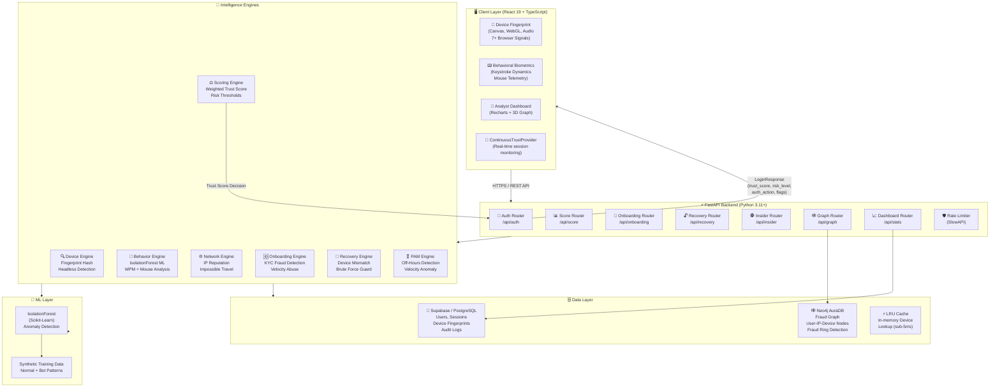
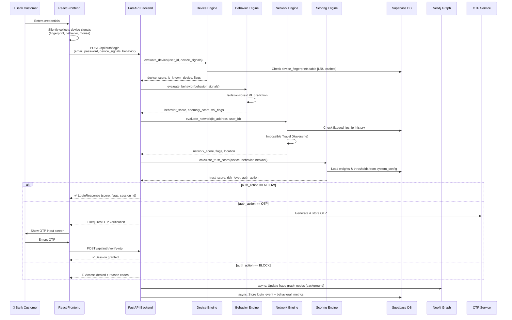
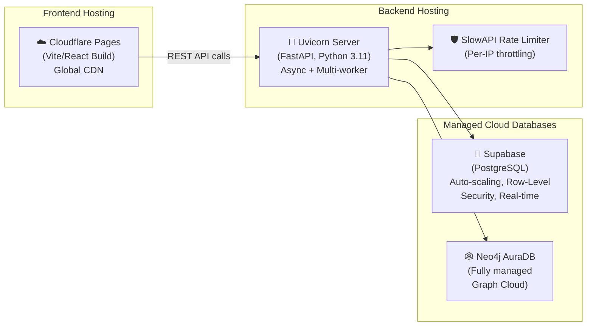

# TrustSphere AI — PPT Slide Deck
### Bank of Baroda Hackathon 2026 | Identity Trust, Protection & Safety

---

## 🎯 RISK COVERAGE ASSESSMENT (Answer to the Hackathon Question)

| Risk Category | Status in Project | Implementation |
|---|---|---|
| ✅ Account Takeover (ATO) | **IMPLEMENTED** | Real-time Trust Score, OTP/Block on score drop, Impossible Travel, mid-session continuous re-evaluation |
| ✅ KYC Fraud | **IMPLEMENTED** | Onboarding Engine — disposable email detection, synthetic identity signals, velocity abuse, bot behavior signals |
| ✅ Insider Threats | **IMPLEMENTED** | Privileged Access Engine (PrivGuard) — off-hours access, high-volume anomaly on admin actions, audit log |
| ✅ Suspicious Account Recovery | **IMPLEMENTED** | Recovery Engine — device mismatch scoring, velocity check (brute force), weak channel risk (SMS, security Q's) |
| ✅ Privileged Access Misuse | **IMPLEMENTED** | PAM Engine detects CONFIG_UPDATED/TRUST_OVERRIDE velocity, off-hours access, anomaly score → FLAG/BLOCK |
| ✅ New Device Risk | **IMPLEMENTED** | Fingerprint Engine — 7+ browser signals hashed, known vs unknown device check, score penalty (-35) for new device |
| ✅ Behavioral Anomalies | **IMPLEMENTED** | Behavior Engine + IsolationForest ML model — keystroke dynamics, mouse speed, WPM analysis, bot detection |

> **All 7 risk categories are addressed and implemented** with dedicated engines in the backend.

---

## SLIDE 1 — TITLE SLIDE

**Title:** TrustSphere AI
**Subtitle:** A Privacy-First, Risk-Based Identity Trust Platform for Real-Time Banking Security

**Tagline:** *"Don't just verify who logs in — continuously validate who's staying in"*

**Event:** Bank of Baroda Hackathon 2026 | Theme: Identity Trust, Protection & Safety
**Domain:** Cybersecurity & Fraud Prevention

**Visual Suggestion:** Dark glassmorphism background with a glowing trust score gauge (0–100) and animated shield icon.

---

## SLIDE 2 — THE PROBLEM STATEMENT

### The Challenge We're Solving

> Traditional banking authentication = **One-time password at login gate**
> This is no longer sufficient in 2026.

### Threat Landscape at Indian Banks:

| Threat | Impact |
|---|---|
| Account Takeover (ATO) | Stolen credentials used from new devices/IPs |
| KYC / Onboarding Fraud | Synthetic identities, burner emails, bot signups |
| Insider Misuse | Admins/analysts abusing privileged access silently |
| Account Recovery Fraud | SIM-swap, social engineering to reset passwords |
| Session Hijacking | Mid-session cookie theft, Man-in-the-Browser attacks |
| Credential Stuffing | High-velocity automated login attacks |

### Key Gap:
- Static, one-time identity checks at login → **no continuous trust validation**
- Friction-heavy MFA applied uniformly → **poor user experience**
- No behavior-aware, adaptive responses to evolving risk

---

## SLIDE 3 — OUR SOLUTION: TRUSTSPHERE AI

### What is TrustSphere AI?

TrustSphere AI is a **real-time, adaptive Identity Trust platform** that:

1. **Continuously evaluates** a dynamic **Trust Score (0–100)** across every banking interaction — not just at login.
2. **Fuses 3 intelligent signal streams** — Device, Behavior, and Network — into a single, explainable trust decision.
3. **Adapts friction automatically** — only triggers OTP/Step-Up when risk truly warrants it.
4. **Maps fraud rings** using a live graph database (Neo4j) to detect organized fraud networks.
5. **Guards privileged users** (admins/analysts) with a dedicated Insider Threat engine.

### Core Principle: Privacy-First
> "We never store what you typed — only *how* you typed it."
> Only keystroke timing metadata (hold times, flight times) is processed — never actual keystrokes.

### Decision Outcomes:
```
Trust Score ≥ 80  →  ✅  ALLOW (seamless access)
Trust Score 60–79 →  🔐  OTP   (step-up authentication)
Trust Score 40–59 →  🔐  OTP   (high risk, step-up required)
Trust Score < 40  →  🚫  BLOCK (critical risk, access denied)
```

---

## SLIDE 4 — SYSTEM ARCHITECTURE DIAGRAM



### Key Architectural Decisions:
- **Async-first**: All network/DB calls are `async` in FastAPI for non-blocking throughput
- **LRU Cache**: Known device lookups cached in-memory (skip DB round-trip) → sub-5ms
- **Decoupled Engines**: Each engine is independently testable and configurable
- **Background Tasks**: Heavy Neo4j graph traversals run in async background tasks, never blocking the auth response

---

## SLIDE 5 — THE 7 INTELLIGENCE ENGINES

### Engine 1: 🔍 Device Fingerprint Engine
- **File:** `backend/app/engines/fingerprint_engine.py`
- Hashes **7+ browser signals**: `user_agent`, `timezone`, `screen_res`, `language`, `platform`, `color_depth`, `touch_points`
- Detects **headless browsers** (Puppeteer, Playwright, PhantomJS, Selenium)
- Checks against `device_fingerprints` Supabase table with **LRU cache** for speed
- **Penalty:** -35 pts for `NEW_DEVICE`, -40 pts for `HEADLESS_BROWSER`, -20 pts for `UNEXPECTED_TIMEZONE`

### Engine 2: 🧬 Behavioral Biometrics Engine (ML-Powered)
- **File:** `backend/app/engines/behavior_engine.py`
- Collects: `key_hold_times`, `flight_times`, `typing_speed_wpm`, `mouse_speeds`, `mouse_event_count`
- **Rule-based checks**: BOT_TYPING_SPEED (>120 WPM), BOT_KEYSTROKE_PATTERN (hold < 25ms), NO_MOUSE_MOVEMENT
- **ML Layer**: Trained `IsolationForest` model on synthetic normal + bot data
- Generates **XAI Explanations** — human-readable reason codes for every decision
- **Privacy**: Only timing metadata stored, never actual keystrokes

### Engine 3: 🌐 Network Intelligence Engine
- **File:** `backend/app/engines/network_engine.py`
- **IP Reputation**: Checks against local `flagged_ips` table (CRITICAL / HIGH severity)
- **TOR Detection**: Pattern matching against known TOR exit node IP prefixes
- **Impossible Travel**: Haversine distance formula — flags if user "teleports" faster than 1000 km/h between logins
- **Geolocation**: Checks if IP is outside India, flags `FOREIGN_IP`

### Engine 4: ⚖️ Scoring Engine (Brain of TrustSphere)
- **File:** `backend/app/engines/scoring_engine.py`
- **Configurable Weights** (loaded from `system_config` DB table, configurable by admin):
  - Device: **40%** | Behavior: **35%** | Network: **25%**
- **Configurable Thresholds**: ALLOW ≥ 80 | OTP ≥ 60 | HIGH OTP ≥ 40 | BLOCK < 40
- Final output: `trust_score`, `risk_level`, `auth_action`

### Engine 5: 🆔 Onboarding / KYC Engine
- **File:** `backend/app/engines/onboarding_engine.py`
- **Disposable Email Detection**: Blocks mailinator.com, 10minutemail.com, tempmail.com, etc.
- **Synthetic Identity Signals**: Detects sequential/repeating ID numbers
- **Velocity Abuse**: Rate-limits signups per device hash / IP (hourly window)
- **Bot Behavior**: Detects paste-only input, zero mouse events, superhuman typing speed

### Engine 6: 🔁 Account Recovery Engine
- **File:** `backend/app/engines/recovery_engine.py`
- **Device Mismatch**: -40 pts if recovery attempted from unrecognized device
- **Velocity Check**: Blocks/flags if >3 recovery attempts in 15 minutes (brute force)
- **Channel Risk**: SMS recovery scored -10 pts, Security Questions -20 pts
- **Outcomes**: ALLOW / STEP_UP / BLOCK

### Engine 7: 🎖️ PAM Engine (PrivGuard — Insider Threat)
- **File:** `backend/app/engines/privileged_access_engine.py`
- **Off-Hours Detection**: Flags admin/analyst access outside 8 AM–8 PM UTC
- **Velocity Anomaly**: Detects CONFIG_UPDATED >2/15 min, TRUST_OVERRIDE >5/15 min, DATA_ACCESS >20/15 min
- **Immutable Audit Log**: Every privileged action stored in `audit_log` table
- **Outcomes**: ALLOW / FLAG / BLOCK

---

## SLIDE 6 — DATA FLOW DIAGRAM



---

## SLIDE 7 — FRAUD GRAPH INTELLIGENCE (NEO4J)

### Why a Graph Database?

Traditional relational DBs can't efficiently answer:
> *"Which accounts share an IP address with a known fraudster?"*
> *"Is this device connected to multiple recently blocked accounts?"*

### Neo4j Graph Model:
```
(User) --[LOGGED_IN_FROM]--> (IP_Address)
(User) --[USES]--> (Device)
(IP_Address) --[SHARED_BY]--> (User)
(Device) --[LINKED_TO]--> (User)
```

### Fraud Ring Detection Logic:
- When a new user logs in from an IP that is **already associated with 3+ flagged users** → `FRAUD_RING_ALERT`
- Simulated fraud rings can be injected via `/api/graph/simulate` for demo purposes
- Real-time D3 Force Graph (3D) visualization in the Analyst Dashboard

### Compliance Value:
- Satisfies **KYC/AML requirements** — detect hidden connections **before** accounts are provisioned
- Prevents **Synthetic Identity Fraud** in onboarding flows

---

## SLIDE 8 — DEPLOYMENT & SCALABILITY

### Current Deployment Architecture



### Scalability Strategy

| Layer | Horizontal Scaling Strategy |
|---|---|
| **Frontend** | Cloudflare CDN — globally distributed, auto-scales |
| **Backend API** | Multiple Uvicorn workers; containerizable with Docker/K8s |
| **Database** | Supabase auto-scales PostgreSQL; pgBouncer connection pooling |
| **Graph DB** | Neo4j AuraDB — fully managed, auto-scaling cloud graph |
| **Rate Limiting** | SlowAPI middleware — per-IP throttling, configurable |
| **Caching** | LRU cache for device lookups — eliminates DB round trips |
| **Async Design** | All IO-bound operations are `async` → handles high concurrency |

### Performance Targets:
- **Sub-80ms** trust score decision latency (device + behavior + network engines in parallel)
- **LRU cache** reduces device fingerprint DB calls to <5ms
- **Background tasks** for Neo4j graph updates — never blocks auth response
- **Rate Limiting**: Prevents credential stuffing attacks at infrastructure level

### Production-Ready Path:
```
Dev → Docker Compose → Kubernetes (GKE/EKS) → Auto-scaling Pods
                ↓
       Secrets in Vault / GCP Secret Manager
                ↓
       CI/CD: GitHub Actions → Staging → Production
```

---

## SLIDE 9 — RELEVANCE TO BANKING TECH STACK

### How TrustSphere Integrates with the Current Banking Technology Ecosystem

#### 🏦 Core Banking System (CBS) Integration
| TrustSphere Component | Banking System Equivalent | Integration Point |
|---|---|---|
| FastAPI REST API | Core Banking API Gateway (Finacle, Temenos) | REST/gRPC adapter |
| Supabase PostgreSQL | Core Banking relational DB (Oracle, DB2) | JDBC / REST data sync |
| Trust Score output | CBS Transaction Authorization Engine | Risk signal feed via API |
| Audit Log | CBS Audit & Compliance Module | Immutable event stream |

#### 📋 Regulatory & Compliance Alignment
| Regulation | TrustSphere Feature |
|---|---|
| **RBI Digital Banking Guidelines** | Risk-based adaptive authentication, step-up MFA |
| **RBI Cybersecurity Framework** | Continuous session monitoring, audit log immutability |
| **KYC / AML (PMLA)** | Onboarding Engine — synthetic identity & fraud ring detection |
| **DPDP Act 2023 (India)** | Privacy-first design — no raw keystroke storage |
| **PCI-DSS** | Encrypted data transit, CORS controls, rate limiting |
| **SEBI / IRDAI guidance** | Insider threat detection with PAM Engine |

#### 🔗 Industry Standard Protocol Alignment
| Protocol / Standard | Implementation in TrustSphere |
|---|---|
| **FIDO2 / WebAuthn** (next step) | Device fingerprinting as hardware attestation layer |
| **OAuth 2.0 / OIDC** | Supabase Auth handles token issuance, TrustSphere adds risk layer |
| **NIST SP 800-63B** | Risk-based authentication matching NIST's AAL tiers |
| **Zero Trust Architecture** | "Never trust, always verify" — every request re-evaluated |
| **MITRE ATT&CK (Financial)** | Behavioral engine maps to T1078 (Valid Accounts), T1110 (Brute Force) |

#### 🔌 Banking Channel Coverage
| Channel | Covered | TrustSphere Capability |
|---|---|---|
| Internet Banking (Web) | ✅ | Full device + behavior + network evaluation |
| Mobile Banking App | ✅ | Mobile UA detection, touch point validation |
| ATM / POS (API layer) | ✅ (partial) | Network/IP evaluation, fraud graph lookup |
| UPI / IMPS | ✅ | Transaction-level behavioral anomaly signals |
| Customer Care (Recovery) | ✅ | Recovery Engine — channel risk scoring |
| Admin/Analyst Portal | ✅ | PAM Engine — insider threat monitoring |

#### ⚡ Tech Stack Relevance to Modern Banking
```
TrustSphere Stack        ←→     Banking Industry Equivalent
─────────────────────────────────────────────────────────
FastAPI (Python)         ←→     Microservices (Spring Boot, Node.js)
Supabase / PostgreSQL    ←→     Oracle DB, AWS Aurora, Azure SQL
Neo4j AuraDB            ←→     TigerGraph (fraud analytics), AWS Neptune
IsolationForest (ML)    ←→     FICO Falcon, SAS Fraud Management
React + TanStack         ←→     Angular / React dashboards (SOC portals)
SlowAPI Rate Limiter     ←→     API Gateway throttling (Kong, Apigee)
Cloudflare CDN           ←→     Akamai, AWS CloudFront
```

---

## SLIDE 10 — INNOVATION HIGHLIGHTS, IMPACT & FUTURE ROADMAP

### 🏆 What Makes TrustSphere Unique?

| Feature | TrustSphere | Traditional Solutions |
|---|---|---|
| Trust evaluation timing | **Continuous (real-time)** | One-time at login |
| MFA trigger | **Risk-based, adaptive** | Always-on (high friction) |
| Fraud ring detection | **Graph-based (Neo4j)** | Simple rule lists |
| Insider threat | **Behavioral + velocity** | Manual audits |
| Explainability | **XAI reason codes** | Black-box scores |
| Privacy | **Keystroke metadata only** | Full behavior recording |
| KYC fraud | **Bot signals + velocity** | Document check only |

### 📊 Expected Impact Metrics

| Metric | Target Improvement |
|---|---|
| Account Takeover incidents | ↓ 70–80% |
| False positive MFA triggers | ↓ 60% (friction reduction) |
| KYC fraud catch rate | ↑ 85%+ |
| Insider threat detection time | From weeks → **real-time** |
| Fraud ring detection | Automated, continuous |

### 🚀 Future Roadmap

#### Phase 2 (3–6 months):
- **FIDO2/Passkeys** integration for passwordless authentication
- **Federated Identity** across Bank of Baroda group entities
- **Real-time ML retraining** with feedback loops (detected fraud → model update)
- **WhatsApp/IVRS channel** risk scoring for phone banking

#### Phase 3 (6–12 months):
- **RBI Regulatory Reporting** — auto-generated compliance reports
- **Cross-bank consortium** fraud ring sharing (with privacy-preserving federated learning)
- **Biometric fusion** — voice print + face liveness for high-value transactions
- **Transaction-level scoring** — evaluate every payment, not just login

### 💡 Key Differentiators for Bank of Baroda
1. **Built specifically for Indian banking context** — India IP geolocation, India timezone defaults, RBI compliance mapping
2. **Open architecture** — REST APIs integrate with any existing CBS without rip-and-replace
3. **Real explainability** — Auditors get human-readable XAI reason codes, not just a score
4. **Privacy by design** — DPDP Act 2023 compliant from day one
5. **Analyst empowerment** — Full-featured SOC dashboard with live session monitoring, graph visualization, and configurable thresholds

---

## APPENDIX — QUICK REFERENCE

### API Endpoints Summary
```
POST /api/auth/login              → Trust Score + auth decision
POST /api/auth/verify-otp         → OTP verification
POST /api/onboarding/evaluate     → KYC risk scoring
POST /api/recovery/init           → Account recovery risk
POST /api/insider/evaluate        → PAM/insider threat check
GET  /api/graph/nodes             → Fraud graph visualization
GET  /api/stats/overview          → Dashboard metrics
GET  /api/sessions                → Session history + risk
PUT  /api/config/thresholds       → Configure risk thresholds
GET  /health                      → Service health check
```

### Trust Score Formula
```
Trust Score = (Device Score × 0.40) + (Behavior Score × 0.35) + (Network Score × 0.25)
             [Configurable weights stored in system_config table]
```

### Flag Reference
```
NEW_DEVICE              → Unknown device for this user
HEADLESS_BROWSER        → Puppeteer/Selenium/PhantomJS detected
BOT_TYPING_SPEED        → WPM > 120 (superhuman typing)
BOT_KEYSTROKE_PATTERN   → Hold time < 25ms (robotic input)
NO_MOUSE_MOVEMENT       → Zero mouse events detected
BEHAVIORAL_ANOMALY      → IsolationForest ML detected anomaly
IMPOSSIBLE_TRAVEL       → Location velocity > 1000 km/h
FLAGGED_IP_CRITICAL     → IP in critical threat DB
TOR_EXIT_NODE           → TOR anonymization detected
FOREIGN_IP              → Access from outside India
HIGH_RECOVERY_VELOCITY  → Brute force on recovery
DISPOSABLE_EMAIL        → Burner email at onboarding
OFF_HOURS_ACCESS        → Admin access outside 8AM–8PM
HIGH_VOLUME_ANOMALY     → Privileged action velocity exceeded
```
